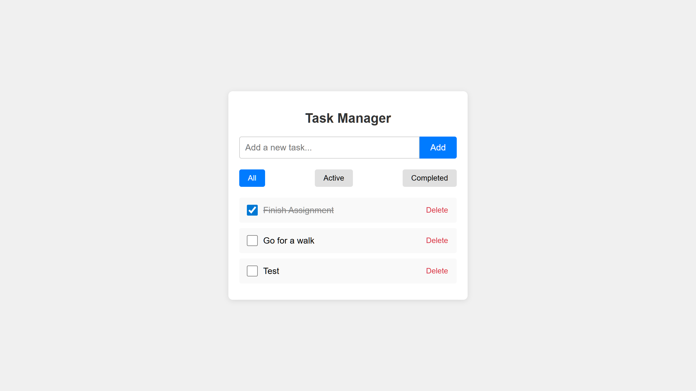

# Task Manager

A simple task manager built with **React**. Users can add, toggle, delete, and filter tasks (all, active, completed) using a clean UI, with no backend required.

---
## Screenshots



---

## Folder Structure
```
task-manager/
│
├── public/
├── src/
│   ├── App.js
│   ├── index.css
│   └── index.js
├── package.json
└── README.md
```

---

## Stack
- **Frontend:** React
- **Styling:** CSS

---

## Local Setup
```bash
# Clone the repository
git clone https://github.com/mevamsireddy/task-manager.git
cd task-manager

# Install dependencies
npm install

# Run the app
npm start  # Runs on http://localhost:3000
